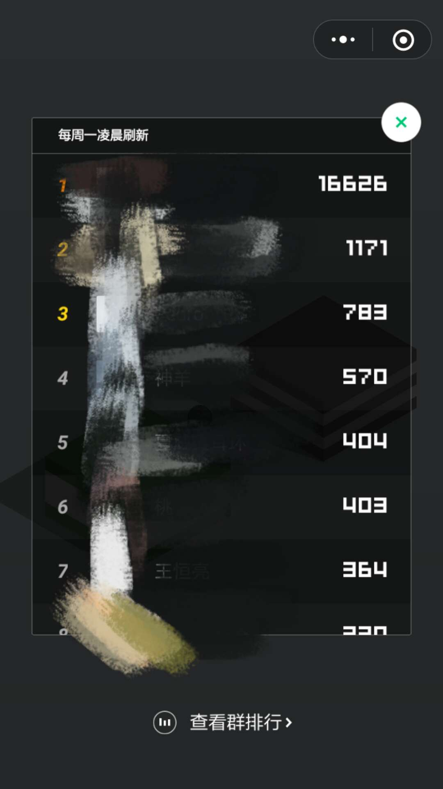

# 自动玩微信小游戏跳一跳

中文说明请点[这里](https://github.com/Prinsphield/Wechat_AutoJump/blob/master/readme_cn.md)

最新修正了一下各种aspect ratio的小问题，如果还有不能正确运行的问题，请发issue.

如果修改sensitivity觉得效果不理想，一般是分辨率不是16:9，导致和resource匹配不准，这种情况建议试一试`nn_play.py`.

### Requirements

- Python
- Opencv3
- Tensorflow (if using `nn_play.py`)

#### for Android
- Adb tools
- Android Phone

#### for IOS (Refer to this [site](https://testerhome.com/topics/7220) for installation)
- iPhone
- Mac
- WebDriverAgent
- facebook-wda
- imobiledevice

### Algorithms for Localization
- Multiscale-search
- CV based fast-search
- Convolutional Neural Network based coarse-to-fine model

For algorithm details, please go to [https://zhuanlan.zhihu.com/p/32636329](https://zhuanlan.zhihu.com/p/32636329).

**Notice: CV based fast-search only support Android for now**

### Run

It is recommended to run the following if have an android phone

	python play.py --phone Android --sensitivity 2.045

If you have an iPhone, download the model following the link below, and run the following

	python nn_play.py --phone IOS --sensitivity 2.045

- `--phone` has two options: Android or IOS.
- `--sensitivity` is the constant parameter that controls the pressing time.
- `play.py` using algorithm based on CV, support Android and IOS
- `nn_play.py` using algorithm based on Convolutional Neural Network, support Android and IOS, recommend for IOS

### Performance

Our method can correctly detect the positions of the man (green dot) and the destination (red dot).

It is easy to reach the state of art as long as you like.
But I choose to go die after 859 jumps for about 1.5 hours.

 

### Demo Video

Here is a video demo. Excited!

### Train Log & Data

CNN train log and train&validation data avaliable at
- [Baidu Drive](https://pan.baidu.com/s/1c2rrlra)
- [Google Drive](https://drive.google.com/drive/folders/1tCUf2krzMpkQh_RJL02x0z__4j7MaUI4?usp=sharing)

**Training:** download and untar data into any directory, and then modify `self.data_dir` in those files under `cnn_coarse_to_fine/data_provider` directory.

**Inference:** download and unzip train log dirs(`train_logs_coarse` and `train_log_fine`) into `resource` directory.

