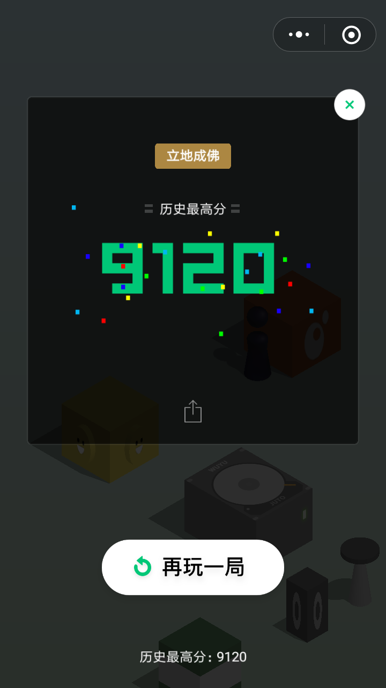

# 自动玩微信小游戏跳一跳

### Requirements

- Python
- Opencv
- Adb tools
- Android Phone

### Run

	python play.py --phone Android --resolution 1280 720 --sensitivity 2.051

- `--phone` has two options: Android or IOS.
- `--resolution` is your phone's height and width.
- `--sensitivity` is the constant parameter that controls the pressing time.

It is easy to reach the state of art as long as you like.

 

### Demo Video

Here is a video demo. (old version)
Current version is much faster than this one. Excited!

Special thanks to [An](https://github.com/Richard-An)'s hacking ideas for speeding up.

